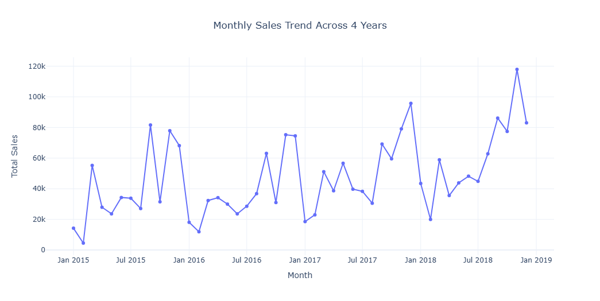

# Global-Superstore-Sales-Analysis-Forecasting
### *Time-Series Analytics • SARIMA Modeling • Business Insights*

---

## **1. Project Overview**

### **Objective**

Analyze historical sales from the Global Superstore dataset, uncover sales patterns, and build a forecasting model to predict **future monthly sales** for actionable business planning.

### **Domain**

Retail Analytics · E-commerce

### **Tools & Technologies**

* **Python** (Pandas, NumPy, Matplotlib, Seaborn, Plotly)
* **Time-Series Modeling:** `statsmodels`, `pmdarima` (Auto-ARIMA)
* **Forecast Evaluation:** RMSE, MAPE
* **Visualization:** Matplotlib, Seaborn, Plotly
* **Environment:** Jupyter Notebook / Google Colab

### **Dataset Source**

Global Superstore Dataset (Kaggle)

### **Dataset Size**

* **Records:** 9,800
* **Features:** 18
* **Time Span:** 2015 – 2018 (Daily)

---

## **2. Data Understanding**

### **2.1 Dataset Description**

A retail transactional dataset including order details, customer information, product hierarchy, geography, shipping, and sales metrics.

| Variable     | Description               | Type        |
| ------------ | ------------------------- | ----------- |
| Order Date   | Date when order is placed | Date        |
| Ship Date    | Shipping date             | Date        |
| Sales        | Order revenue             | Numeric     |
| Quantity     | Units purchased           | Numeric     |
| Category     | Product category          | Categorical |
| Sub-Category | Product sub-category      | Categorical |
| Region       | Customer region           | Categorical |
| Segment      | Customer segment          | Categorical |
| …            | …                         | …           |

### **2.2 Initial Observations**

* No major missing values found.
* Duplicates checked and removed.
* Sales distribution highly skewed with outliers.
* Strong temporal patterns visible.

---

## **3. Data Preparation**

### **3.1 Cleaning**

* Removed duplicates
* Fixed inconsistent types
* Detected and handled outliers using **monthly mean replacement** to prevent distortion

### **3.2 Transformation**

* Converted dates to datetime
* Created new columns:

  * Year, Month, Day, Weekday
  * Aggregated daily → monthly for forecasting

### **3.3 Feature Engineering**

* Monthly sales series created for stable modeling
* Additional time-indexed features for analysis

---

## **4. Exploratory Data Analysis (EDA)**

### Key EDA Insights

* **Seasonality:** Strong yearly peaks (Q4 highest).
* **Weekly pattern:** Mid-week spikes; weekends lowest.
* **Category performance:** Technology leads revenue.
* **Regional performance:** West & Northeast strongest markets.
* **Trend:** Slight upward trend from 2015 to 2018.
* **Cities:** NYC & LA generate highest sales.

### Example EDA Visuals (Insert Plots Here)

```markdown



```

---

## **5. Statistical & Diagnostic Analysis**

* Correlation analysis confirms expected relationships
* Data becomes stationary after outlier adjustment
* ACF/PACF indicate both autoregressive and seasonal components
* Seasonal decomposition reveals:

  * Clear upward trend
  * Strong yearly seasonality
  * Noise stabilizes with monthly aggregation

---

## **6. Forecasting Model Development**

### **6.1 Model Selection & Justification**

* Daily sales too noisy → poor forecasting accuracy
* Monthly aggregation reveals stable patterns (trend + seasonality)
* SARIMA chosen because it:

  * Handles seasonality (m=12)
  * Works well with stationary data
  * Requires no external regressors
* Holt-Winters as backup, but SARIMA gives more control

### **6.2 Data Splitting**

* **Training:** Jan 2015 – Sep 2018
* **Testing:** Oct 2018 – Dec 2018
* Time-based split (no shuffling)

### **6.3 Model Development**

SARIMA via Auto-ARIMA:

```python
auto_model = pm.auto_arima(
    monthly_sales_cleaned,
    seasonal=True,
    m=12,
    stepwise=True,
    trace=True
)
```

### **6.4 Model Evaluation**

#### **Daily Forecast (SARIMA)**

* Captures weekly cycle + trend
* Fails to capture daily volatility
* **RMSE:** ~853
* **MAPE:** ~126% (Not reliable)

#### **Monthly Forecast (SARIMA)**

* Excellent trend + seasonal learning
* Flat first year due to seasonal initialization
* **RMSE:** ~13,436
* **MAPE:** ~19% (Strong performance)

### Visualization (Insert Plot)

```markdown

```

---

## **7. Key Findings & Insights**

### Analytical Insights

* Sales show strong yearly seasonality
* Technology and Office categories dominate revenue
* West & Northeast outperform other regions
* End-of-year (Nov–Dec) = highest peak annually
* Daily sales fluctuate unpredictably → volatile noise

### Modeling Insights

* Daily level forecasting is **unreliable**
* Monthly SARIMA model is **stable, interpretable, and practical**
* Monthly model can support budgeting, staffing, and procurement decisions

---

## **8. Recommendations**

* Use **monthly forecasting** for financial and operational planning.
* Begin inventory stocking earlier in Q4 to capture the seasonal surge.
* Boost marketing in **Western + Northeastern regions** for maximum ROI.
* Launch campaigns for underperforming segments (Home Office).
* Consider external factors (holidays, promotions) for improved daily modeling.

---

## **9. Conclusion**

* The project successfully analyzed sales patterns and created a reliable monthly forecasting model.
* Monthly SARIMA forecasts proved far more accurate than daily models due to reduced noise.
* Insights from product, region, and segment analysis can directly inform strategic decisions.

---

## **10. Appendix**

* Raw statistical outputs
* Seasonal decomposition plots
* ACF/PACF charts
* Model summary tables
* Additional EDA visualizations

---

